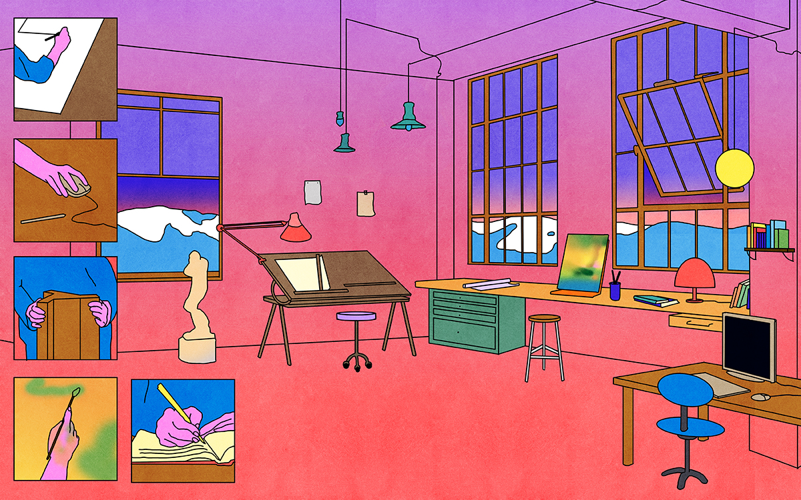

<figure>

<figcaption>Illustration by María Medem.</figcaption>
</figure>

*This piece was originally published by [AIGA / Eye on Design](https://eyeondesign.aiga.org/when-did-design-stop-being-multidisciplinary/)*

***

Around the same time every year, half-way through the Spring semester, just as the pull of Summer begins, my students begin asking variations of a similar question. My graduate students, unsure of how to organize the weird experiments they’ve been doing for the last few years into a coherent portfolio, want to know how to pitch themselves to potential employers. My seniors, beginning to worry about looking for jobs for the first time, ask about how to position themselves: are they product designers or UX designers, print-focused or web-focused? Should they be generalists or specialists? And then my younger students wonder what their concentration should be. (Many design schools have students pick a disciplinary track like ‘branding,’ ‘interactive,’ or ‘advertising’ during their sophomore year with designated classes for each.) They’re afraid of picking the wrong one, of choosing a focus too early.

What these questions show is that as the design field has expanded, it has also fragmented. As the definitions and boundaries of design have blurred — opening up even more opportunities for designers to work in a variety of scales and mediums, contexts and cultures — the working conditions of the contemporary designer have become ever-more siloed. When design can mean so many different things, to simply call yourself a designer is too vague, so [we add increasingly specific descriptors to the front of our titles](https://eyeondesign.aiga.org/in-defense-of-generalism/): Digital Visual Designer, UX/UI Designer, Product Designer, Brand Designer, Design Researcher, Data Designer, Production Designer, Design Engineer… No wonder students are confused as they move from the classroom to the workplace. From the beginning of a designer’s education, a student is asked to pick a focus, and then four years later, when applying for jobs, are again faced with the task of declaring a specific area of expertise that matches a specific job they might be applying for, sometimes in a specific industry.

I’ve noticed another title, too, another type of designer. This one isn’t typically on job boards but can be found on designers’ resumes and websites: the Multidisciplinary Designer. Where those other titles promote a specific skill set or focus, to be multidisciplinary is to reject the ever-increasing specialization in the industry. The multidisciplinary designer works in both print and digital! The multidisciplinary designer designs apps and brands! The multidisciplinary designer is serious and educated and won’t be placed into an overly specific job. All of which makes it tempting to think of the multidisciplinary designer as something new (I’ve also started seeing related terms like ‘Transdisciplinary Designer’ and ‘Interdisciplinary Designer’ recently, too), a reaction to the splintering and compartmentalizing that permeates the field, a preview of a new type of designer who transcends these silos allowing everything to blur together. But this new title, describing a specific type of designer, is just that: a new term for a type practice that was once the norm. A look through history shows us that multidisciplinary is what design has been all along.

**[Read the rest of the essay on *Eye on Design* →](https://eyeondesign.aiga.org/when-did-design-stop-being-multidisciplinary/)**
