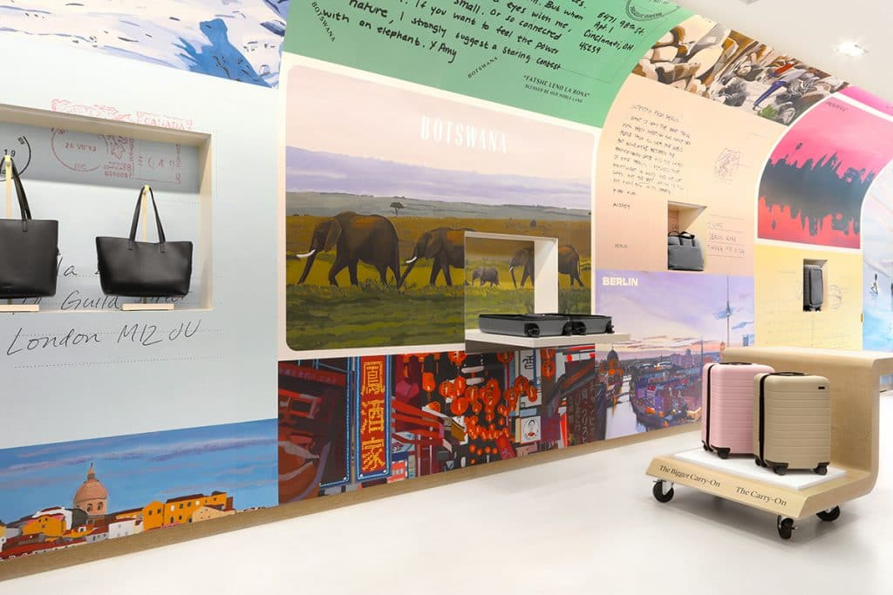

<figure>

<figcaption>Away, Dallas Flagship. Courtesy Mythology.</figcaption>
</figure>

*This piece was originally published by [AIGA / Eye on Design](https://eyeondesign.aiga.org/as-social-media-reshapes-branding-retail-stores-become-more-like-sponsored-content/)*

***

In 2001, students at the Harvard Graduate School of Design, under the direction of architect Rem Koolhaas, published [*The Harvard Guide to Shopping*](https://oma.eu/publications/project-on-the-city-ii-the-harvard-guide-to-shopping), a wide-ranging survey of the spaces, techniques, and ideologies embedded in contemporary retail experiences. Moving from early village markets to the first arcades, then into malls and airports, they argue that shopping has infiltrated every aspect of our daily lives, profoundly influencing one’s experience of the city — the city, in essence, has become one big mall. But it also goes a step further: not only has retail infiltrated all of public space, it’s completely reshaped our conceptions of what public space is.

The research clearly had an impact on Koolhaas, whose firm OMA was at the same time designing Prada’s flagship store in New York’s SoHo. The two level store feels less interested in filling the space with product than creating an experience. In the New York Times, the paper’s then-architecture critic Herbert Muschamp — in a review titled [*Forget the Shoes, Prada’s New Store Stocks Ideas*](https://www.nytimes.com/2001/12/16/style/critic-s-notebook-forget-the-shoes-prada-s-new-store-stocks-ideas.html) — marveled at how little of the floor plan was actually dedicated to product. Instead, the store featured wall-length murals (designed by New York based studio 2×4) and a sloping ramp to the basement level that could double as stadium seating, turning the store into an event space. The dressing rooms were outfitted with video screens and technology was implemented so customers could check out anywhere. “If you’re in the market for ideas, here’s the place to stock up,” Muschamp wrote, “Think of this as a museum show on indefinite display.” (In a bit of irony, the space was the former home to the Guggenheim Museum’s SoHo outpost.) Twenty years later, Koolhaas’s theories prove prescient and Muschamp’s description of Prada could apply to any number of retail experiences around the world. In fact, a whole industry around “experience design” has built up around retail stores. Luxury brands have always seen their brick and mortar stores as destinations, but as more and more shopping moves online, perhaps even more so in a post-pandemic world, the flagship concept has been democratized — a store is no longer simply a place for *commerce*, it must also be a place for *content*.

This is seen most clearly in the direct-to-consumer brands who have been opening retail shops of their own in trendy neighborhoods in cities around the country. Throughout the 2010s, brands like Casper and Warby Parker, Allbirds and Glossier, marketed convenience — you no longer need to go to the mall optometric or the local mattress shop, it’d just come right to your door! — while wrapping otherwise utilitarian products (glasses, sneakers, mattresses, face wash) inside a fully-branded package. They mixed good design and a strong social media game with the ease of one-click shopping, [foreshadowing an end to brick-and-mortar retail](https://www.theatlantic.com/business/archive/2012/04/the-end-of-retail-why-the-future-of-shopping-doesnt-need-workers/255863/). So when these brands started opening retail spaces of their own over the last few years — beginning with temporary pop-ups before quickly moving into full fledged brick and mortar shops — they borrowed the language of the luxury flagship. They are not simply places to shop, but also destinations, experiences, *content*. A brick and mortar store can do many things a website cannot: provide a place to feel the materials, try items on, and experience the product in a real context—but what they do best is create a space for the brand’s faithful to congregate. These stores are less brazen shopping experiences and more like immersive sponsored content: works of total branding, temples unto themselves, a capitalist *Gesamtkunstwerk*.

**[Read the rest of the essay on *Eye on Design* →](https://eyeondesign.aiga.org/as-social-media-reshapes-branding-retail-stores-become-more-like-sponsored-content/)**
