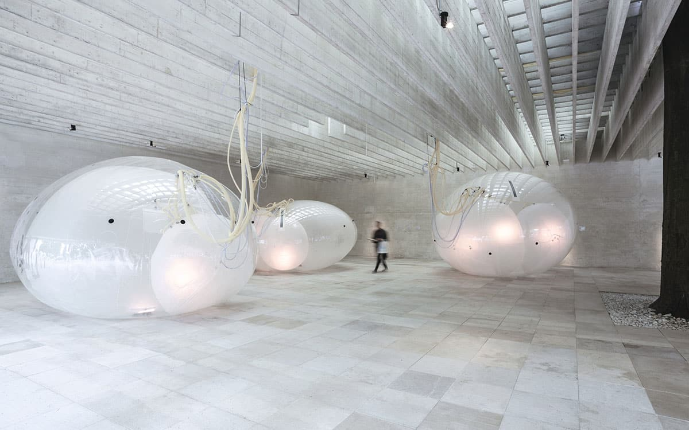

<figure>

<figcaption>Lundén Architecture Company, Another Generosity, 2018. Photo by Andrea Ferro Photography. Courtesy the designer.</figcaption>
</figure>

*This piece was originally published by [AIGA / Eye on Design](https://eyeondesign.aiga.org/every-act-of-design-is-an-act-of-future-making/)*

***

“The moment just past is extinguished forever,” wrote the art historian George Kubler in his 1962 book, *The Shape of Time*, “save for the things made during it.” This is the power of graphic design. It is not simply artifacts that live in isolation but markers in time, telling us stories about the people and cultures who made it. The best design exhibitions don’t merely present us a series of objects, isolated from context in a white cube, but tell a larger story, whether that’s cultural, political, economic, or geographic.

[*Designs for Different Futures*](https://walkerart.org/calendar/2020/designs-for-different-futures), an exhibition jointly produced by Walker Art Center, the Philadelphia Museum of Art, and the Art Institute of Chicago, is interested in how these objects, systems, and structures exist not only as markers of the past, but also as pointers into the future. The show — which closed in Philadelphia at the beginning of the year and is set to reopen at the Walker in September before moving to Chicago next year — interrogates the relationship between design and future-making. (I was unable to see the exhibition in person, but the [accompanying publication](https://yalebooks.yale.edu/book/9780876332900/designs-different-futures), published by Yale University Press, is packed with images, interviews, and critical essays.) While the exhibition presents a veneer of futuristic imagery, sometimes feeling as if it was pulled from an episode of *Black Mirror* or Spike Jonze’s *Her*, the curators are ultimately less interested in design that make sci-fi predictions about how the future will look, as they are in how the designs of today raise questions about the futures we want.

These questions complicate both our perceptions of what design is and how it lives in the world. In between the stereotypical futuristic projects — the spore-encouraging concrete or the apparel made from bodily fluids — are more banal inclusions: a nondescript seed vault on the Norwegian countryside, a typeface unable to be read by computers, a line of makeup products. By including projects like these, those rooted in and responding to present circumstances, the curators make the argument that today’s design becomes the seeds for tomorrow. The subliminal message underlying the entire exhibition is that the designer, through the creative process, in making something that wasn’t there before, continually creates new futures. Every design decision, every piece of design that is put into the world, opens up new worlds, creating new timelines into the future. Every act of design is an act of future-making.

**[Read the rest of the essay on *Eye on Design* →](https://eyeondesign.aiga.org/every-act-of-design-is-an-act-of-future-making/)**
