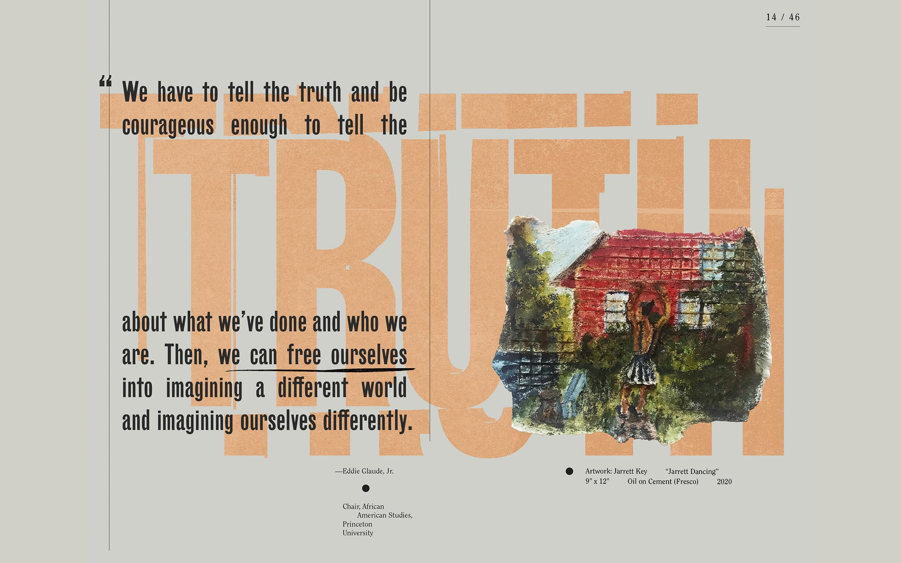

<figure>

<figcaption>Spread from "Confronting Unjust Policing Primer." Courtesy Isometric Studio.</figcaption>
</figure>

*This piece was originally published by [AIGA / Eye on Design](https://eyeondesign.aiga.org/isometric-studio-is-rethinking-what-it-means-to-design-for-social-good/)*

***

What does it mean to design for social change? For decades designers have tried to push the profession into more humanitarian causes with varying success. In 1964, for example, the designer Ken Garland along with 20 other designers, critics, and students, published [First Things First](http://www.designishistory.com/1960/first-things-first/), a manifesto calling on graphic designers to abandon their obsession with commercial work in favor of projects that help humanity. It made a splash, including a BBC news segment featuring Garland, but so little changed in the years following that in 2000, another group of designers picked up the cause and published a new edition of the manifesto in Adbusters. Twenty years after that update — after a year of divisive politics, racial reckonings, and a raging pandemic — designers are yet again forced to rethink their work and the difference it makes in the world.

Andy Chen and Waqas Jawaid, partners of the Brooklyn design firm [Isometric Studio](https://isometricstudio.com/), are two of these practitioners who are rethinking the role of the graphic designer in building a better world. Chen and Jawaid are less interested in writing manifestos decrying capitalism or making broad declarations about the role of the designer as they are in using design itself as a tool for empowering those who are too often left behind. For them, designing for social good is core to who they are as designers — and people — and foundational to the studio’s output. This approach is rooted in their own experiences as queer people of color, who have been married since 2014 and often felt like outsiders in the circles they found themselves in. “We never felt a sense of belonging,” Chen says, noting the pervasive whiteness of the design profession (Of the 21 designers who signed the original First Things First Manifesto, 18 were men, all of them white) “but we wanted to add to this conversation. We had this desire to formulate a theory about how we think design can lift up the most marginalized people and focus the concentration of power that the design accords to their narratives.”

In describing their approach, they contrast it with the way designers have historically created work for social good. Large brands led the early attempts at social design; they used their brand vocabulary to project social responsibility and humanitarian causes, often promoting causes without doing the work to enact change (think the ‘conscious capitalism’ movement). Then came design studios like IDEO who developed processes pulled from service design and design thinking to codify social design into particular deliverables that can be used in any context. There is nothing inherently wrong with this work, Chen and Jawaid are quick to point out, but they think there is still more work to do. This means being more sophisticated about how we practice and talk about the role of design, working with and responding to individual communities, sometimes at the systemic level, as opposed to the designer coming in with premade solutions. It also means looking for universal solutions — ‘sticky-noting the process’ — for specific problems will only reinforce the status quo. “Can we be more like sociologists or policymakers?” Chen asks. “How do we design for these social issues in a way that doesn’t just reflect back our own stylistic preference or celebrity or propping up of the design field, but instead creates truly empowering tools for the very people that design is supposed to benefit?”

Chen and Jawaid met while undergraduate students at Princeton in 2006 when Chen was a sophomore and Jawaid a freshman. Chen, the son of Taiwanese immigrants, was studying sociology and Jawaid, who grew up in Pakistan, was studying architecture. They worked side by side in a student-run graphic design agency on campus and volunteered in other on-campus organizations together. Working at the student design agency allowed Chen to see graphic design as an extension of his sociology work and he was encouraged to continue studying design. After a fellowship at the Royal College of Art, he received an MFA in graphic design at RISD and went to work for Paula Scher in Pentagram’s New York office. In 2013, he co-founded Isometric Studio with Alex Huang. Jawaid, meanwhile, started to grow disillusioned with architecture after cutting his teeth in firms around the world like OMA, SAANA, and SOM, and decided to join Chen at the studio in 2014 (Huang was leaving to join a startup), a month after the couple married.

**[Read the rest of the essay on *Eye on Design* →](https://eyeondesign.aiga.org/isometric-studio-is-rethinking-what-it-means-to-design-for-social-good/)**
