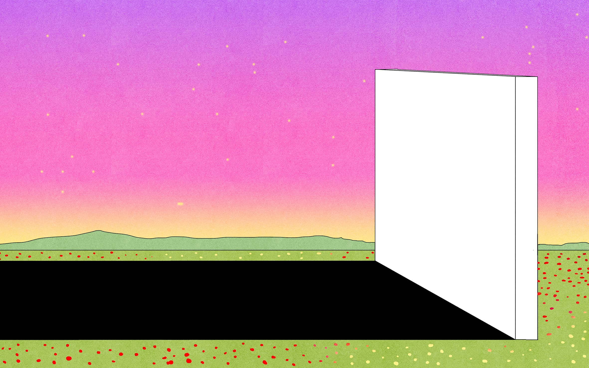

<figure>

<figcaption>Illustration by Maria Medem.</figcaption>
</figure>

*This piece was originally published by [AIGA / Eye on Design](https://eyeondesign.aiga.org/graphic-designers-have-always-loved-minimalism-but-at-what-cost/)*

***

Stop me if you’ve heard this one before: Company X announces a new logo with a buzzword-filled press release. *We’ve been hard at work for months in rethinking how to best represent ourselves to our customers*, it reads. *We think this new logo reflects our values by signaling simplicity and approachability.* Can you picture it? It’s a sans-serif wordmark (bonus points if it’s a geometric typeface like Avenir or Proxima Nova. Maybe even Helvetica) and set in a solid color (maybe primary, but ideally a tertiary. Think a cool greenish blue or warm mauvey-red).

What seemed like a fun joke a few years ago quickly moved from trend to meme to the dominant visual style in branding. In the last few years, it seems every big company, from Warner Brothers to PetCo to Mastercard to Sam’s Club has jumped on the bandwagon, stripping their brand down to basic parts, cohering around a homogenized, minimal aesthetic that can sell anything from dog food to data, credit cards to car rides. (There are, of course, brands that divert from this stylistically, but the component parts are the same: flat colors, clean type, and lots of whitespace—using a serif typeface is hardly a differentiator.) In an article for *Vox* in 2017, the writer Eliza Brooke called this aesthetic “startup minimalism,” following a string of Silicon Valley rebrands including Facebook, Google, Pinterest, Pandora, Spotify, and Uber who all employed new geometric sans-serif wordmarks, effectively removing the personality of the previous identities. Brooke wrote that these new, minimalist logos reflect the products they’re selling, a visual indication of “how that product will be purchased and delivered to the shopper: digitally, easily, inexpensively, and with a smile.”

Minimalism in graphic design can mean all sorts of things in all sorts of contexts but no matter what, it is clearly popular. A search for “minimalist graphic design” on any visual search engine will return an endless stream of movie posters simplified to icons, band posters reimagined as if they were designed by a Swiss Modernist, brutalist websites with default black and white styling, interface mockups stripped of context or detail, and logos upon logos boiled down to basic elements. Medium, which got its own version of a minimalist rebrand, is filled with think pieces about creating minimal designs and simple user interactions. Interface design, too — whether a shopping experience, a mobile app, or social media interaction — is focused on erasing all moments of friction by simplifying the number of clicks, the range of interactions, the paths the user can take through a predetermined flow. One of industrial designer Dieter Rams’s famous maxims, printed on posters in design studios around the world, is “good design is as little design as possible,” and Apple’s Jony Ive echoed this when, referring to a new iPhone, said, “You should almost get the sense that it wasn’t designed at all.” In the early 2010s, Microsoft, Google, and Apple quickly abandoned the 3D, skeuomorphic interfaces (drop shadows, faux leather, and paper textures) in favor of flat design, signaling a return to the Bauhausian principles that materials should reflect their use, and decorative flourishes impeded function.

The history of design is a pendulum, and each new aesthetic and approach is a reaction to what came before it. The “New Wave” postmodernists of the ’80s and ’90s were responding to the strict design systems of the Modernists; the bubbly aesthetics of web 2.0 brands and skeuomorphic interfaces were a visual explosion after years of websites designed by engineers. Yet these movements are largely seen today as outliers: as experimental, diversions, moments of unnecessary indulgence on the designer’s ultimate quest for a simplified world. For much of the Western world, the design history pendulum always, inevitably, swings back to minimalism. What if this recent spate of rebrands, then, is less a passing fad — a lack of creativity among contemporary graphic design — and more a natural endpoint in a profession forever obsessed with simplifying?

**[Read the rest of the essay on *Eye on Design* →](https://eyeondesign.aiga.org/graphic-designers-have-always-loved-minimalism-but-at-what-cost/)**
