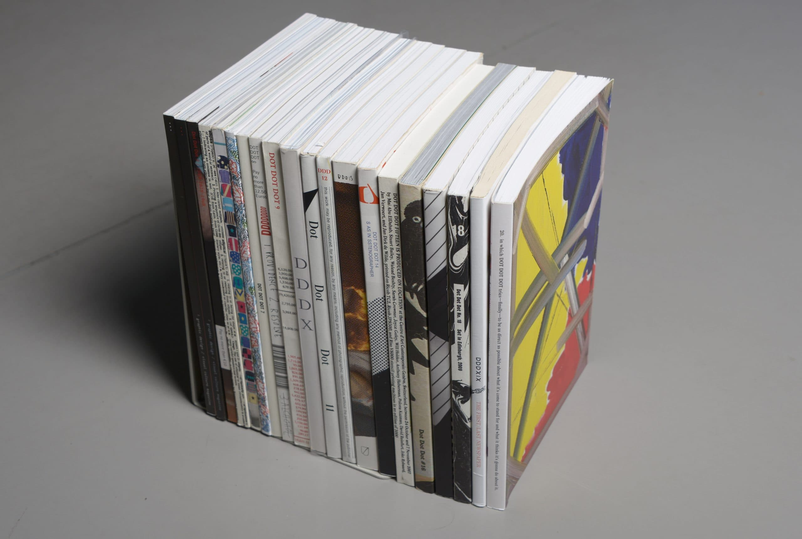

<figure>

<figcaption>All twenty issues of Dot Dot Dot. Image Courtesy Peter Bil'ak.</figcaption>
</figure>

*This piece was originally published by [AIGA / Eye on Design](https://eyeondesign.aiga.org/dot-dot-dot-is-the-most-influential-design-magazine-youve-never-heard-of/)*

***

“Why another graphic design magazine?” asked the cover of the first issue of *Dot Dot Dot*, published in April 2000. “The pilot issue hopes to answer itself, being an encyclopedia of previous attempts.” And so begins this new magazine founded by graphic designers Peter Bil’ak, Stuart Bertollotti-Bailey, and Jürgen X. Albrecht. A quasi-meta analysis of design magazines and publishing, the issue includes critical  analysis of *Emigre* and *Hard Werken*, an interview with Rick Poynor of *Eye*, a conversation with the editors of *Typografische Monatsblätter*, and even an alphabetized encyclopedia of 20th century graphic design periodicals. “In compiling these pieces we hoped to syphon off some wisdom and help plot our next move,” the editors write in the introduction. This rigorous meta-analysis immediately inserted*Dot Dot Dot* into the lineage of design journalism and set the tone for its entire run of 20 issues which were released biannually from 2000 to 2010.

In 2005, Poynor described Dot Dot Dot as “the most stimulating and original visual culture magazine produced by designers since Emigre’s heyday in the late 1980s to the mid-1990s.” Certainly, if you were a particular type of designer in the early 2000s, *Dot Dot Dot* was the most exciting publication you could find. Yet unlike Emigre, the popular design magazine published by Rudy Vanderlans and Zuzana Licko through the ’90s, *Dot Dot Dot* was much harder to define. To try to describe it is to describe a series of contradictions: it was both high brow and humorous, exclusive and accessible, over-designed and under-designed, self-serious and self-deprecating, neither academic nor trade journal, and—as Bertollotti-Bailey said to me—“both invested in graphic design and dismissive of graphic design.” (A French publication once described its design with another contradiction: “carefully contrived flippancy.”) Moreover, to call *Dot Dot Dot* a ‘graphic design magazine’ is both reductive and inaccurate. Over the course of its life, it published unique and idiosyncratic stories, expanding the original design focus out into film, music, literature, and art. Despite only printing 3000 copies of each issue and ending its run a decade ago, the ethos that drove the magazine, both editorially and aesthetically, continues to influence vast sections of the design landscape. Dot Dot Dot is, perhaps, the most influential design publication you’ve never heard of.

Launched while Bil’ak was a student, *Dot Dot Dot* hoped to fill a gap he saw in how design was discussed. “On one side you had portfolio magazines where you looked at work and the text was just some captions. Then you had magazines like Visual Language that were very theoretical and academic but uninterested in anything else,” Bil’ak told me. “We hoped there could be a way where practitioners could discuss the theoretical and tangential things that weren’t directly connected to your practice instead of just talking about production and printing techniques.” In retrospect, *Dot Dot Dot* launched at a peculiar time for media, and especially design media—caught in the transition from a print dominated media system to a digital one. It sat in between the explosion of design writing during the ’90s, when publications like Emigre and Eye offered a future of rich design criticism and the weblogs of the late 2000s like Design Observer and Speak Up, a prelude to our current social media-driven world.

The first few issues did focus squarely on graphic design, with stories about typographic history, interviews with designers and essays by Bil’ak and Bailey along with people like Paul Elliman, Michael Rock, Daniel Eatock, Daniel van der Velden, and Robin Kinross (while later issues did expand the pool of writers, the first few issues predominantly featured men). The writing was both intellectually rigorous and formally daring, falling between academic writing and trendspotting. As the editors wrote in the first issue: “We want our magazine to be both read and looked at,” before noting the writers of each piece designed their own spreads, marrying form and content from the outset. The first few issues featured longform essays on historical figures like typographer Anthony Froshaug and the fictional Swiss designer Ernst Bettler, critical analysis of ephemeral fliers and the influence of technology, and meditations on contemporary design practice.

**[Read the rest of the essay on *Eye on Design* →](https://eyeondesign.aiga.org/dot-dot-dot-is-the-most-influential-design-magazine-youve-never-heard-of/)**
