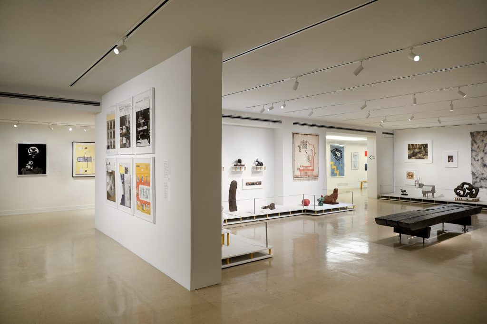

<figure>

<figcaption>With Eyes Open, curated by Andrew Blauvelt at the Cranbrook Art Museum. Courtesy Cranbrook Art Museum.</figcaption>
</figure>

*This piece was originally published by [AIGA / Eye on Design](https://eyeondesign.aiga.org/how-cranbrooks-design-program-redefined-how-we-make-and-talk-about-graphic-design/)*

***

There’s a quote, perhaps apocryphal, from Massimo Vignelli that you’ll sometimes hear from alumni of Cranbrook Academy of Art’s design department. “Cranbrook”, he supposedly said, sometime in the ’80s or ’90s, “is the most dangerous design school in America.” They recite this like a badge of honor, though no one I spoke with is quite sure when or where he said it. It might have been in an interview or on stage at a design conference. Maybe it was just in conversation with a friend. But does it matter? Even if he never said it, the sentiment was (is?) shared by flocks in the design profession. The myth and mystique around Cranbrook is prone to strong emotions and bold statements. You either love it or you hate it. In 1984, for example, Paul Goldberger, the then-architecture critic of The New York Times wrote that “Cranbrook, more than any other institution, has the right to think of itself as synonymous with contemporary American Design.” And an article [in *Eye*](http://www.eyemagazine.com/feature/article/the-academy-of-deconstructed-design) noted how the design department had been accused of “hermeticism, formalism, theoretical obfuscation and other crimes against the values of both classic Modernism.” I want to add my own hyperbole to the list: For the last 50 years, the students at Cranbrook have continually produced some of the most interesting, unusual, and theoretically rigorous graphic design anywhere in the world.

Some of this work can be seen—alongside work from the school’s other departments across art and design ranging from architecture to product design, painting to fibers, sculpture to printmaking—in the appropriately bold [*With Eyes Open*](https://cranbrookartmuseum.org/exhibition/with-eyes-opened-cranbrook-academy-of-art-since-1932/), a massive exhibition (and 624 page book) of work from past and current students and faculty, curated by Andrew Blauvelt and currently on view at the Cranbrook Art Museum. Blauvelt, the museum’s director and a former student of the famed, or infamous, design department, spent the last four years in the school’s archives, looking at work from students, faculty, and friends to help tell the story of how this small graduate school in a suburb of Detroit has always been ground zero for innovation in art, architecture, and perhaps especially, graphic design.

Cranbrook was founded in 1904 as family country estate of Michigan newspaper magnate George Gough Booth and his wife Ellen. The couple had purchased large tracts of land in Bloomfield Hills with the hope of turning it into an experimental arts colony modeled on the American Academy in Rome and hired Finnish architect Eliel Saarinen to design a master plan, slowly turning their property into a series of schools, museums, and the Academy of Art, which opened in 1932. Saarinen, who also developed the curriculum and served as its first president, immediately made architecture a central part of this new institution. Like other architects of the era, he took an expansive view of what the architect could do, not simply interested in buildings but in the design of everything from products to city plans to graphics.

Graphic design’s history in the academy is hard to trace, but it was clearly there at the outset. “From the beginning, there was an emphasis on printmaking and book binding because of Gough’s work in newspapers,” Blauvelt told me. “We used to have a bookmaker in residence on campus.” While graphic design did not yet have its own department, Saarinen’s daughter, Pipsan, an interior designer, taught the basics inside the school’s more general “design” department. For the first few decades, the design department cycled through directors quickly. Most notable was Charles Eames, who studied under Eleil in the architecture department before running the design department in the late ’30s. The alumni of this era reads like a superteam of mid-century modern designers: Ray Eames, Eero Saarinen (Eliel’s son), Harry Bertoia, Florence Knoll, and Gere Kavanaugh. Because of the Eames’s connections, the design department’s early focus was on furniture, product, and interior design, maintaining a strong connection to Michigan-based furniture company Herman Miller (Stephen Frykholm, who graduated from Cranbrook in 1969, was the company’s first graphic designer).

**[Read the rest of the essay on *Eye on Design* →](https://eyeondesign.aiga.org/how-cranbrooks-design-program-redefined-how-we-make-and-talk-about-graphic-design/)**
