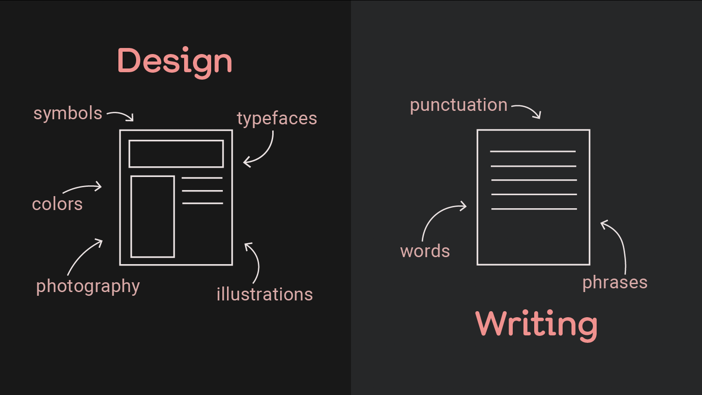

<figure>

<figcaption>Image by Laura Thompson.</figcaption>
</figure>

As part of the 2021 AIGA Design Conference, I co-organized a workshop with Liz Stinson for Eye on Design called "Design Writing 101: How Writing Is a Lot More Like Designing Than You Think". The 2 hour workshop features short presentations from myself and Liz, a panel discussion featuring Aggie Toppins, Anne Quito, and Molly Heintz, and a participatory workshop on interviewing and writing.

Below is part of the transcript from the panel discussion. [You can read the entire thing on Eye on Design](https://eyeondesign.aiga.org/how-designing-and-writing-are-more-alike-than-you-think/).

* * *

**What is your relationship to writing?**

**Aggie Toppins:** I’ve been practicing design for about 20 years. About half of that time was in the industry, and half of it was in the academy. Writing about design is a newer development in my career — I’ve been consistently publishing for a little over a year-and-a-half. But I think my relationship with writing began a long time ago when I worked at an agency in Chicago called Simple Truth. I worked with amazing copywriters there, who were just great conceptual partners on the work. And I started to see how effective visuals and effective writing make for really great design. But I also worked with super talented copy editors who, just by watching them work, I learned a lot about the craft of writing.

I didn’t take a writing course until graduate school, and I had a couple of classes with David Barringer at MICA. And he was just really great at teaching writing to visual thinkers. And so now that I’m in an academic career, I find myself writing as often, if not sometimes a little more often these days, than practicing design. And I do see them as compatible languages and compatible forms of inquiry. There are things when I write that I can explore differently than when I design. And even though they’re so compatible, I do think that they’re different head spaces for me still. I have to admit it, it took me a long time to feel comfortable calling myself a writer, but I do feel like I think natively in that language now.

**Anne Quito:** I am a journalist and design critic at Quartz, which is a little offshoot started by Atlantic media. I’ve been there for about seven years. In a previous life, maybe very few people know (I rarely divulge this to graphic designers I interviewed because it’s a little secret power), I used to be a graphic designer, and I founded a design studio. Before being in the SVA program that Molly runs, honestly, I never thought about myself as a writer. The teachers, they’re all great editors, gave me confidence to write and then, lo and behold, soon after graduation, I got an invite from the editor of this publication [Eye on Design]. And it was a nice nudge—or shove—into journalism. And I am still here.

**Molly Heintz:** I run the design research, writing, and criticism program here at SVA. It is a two semester intensive MA program that uses the lens of design to write about the world and think about design’s context and consequences. A lot of the people who come to our program are designers or have some sort of design background. But it’s also a mix of people who might be coming from more arts and journalism places, too, and are interested in writing about design. But how I got into all of this — I was actually in a Ph. D. program in the history of architecture, studying the ancient world and medieval topics. I was working on my dissertation one day and the stacks, and I was just like, “Man, I’ve got to get out of here, I need to be connected to contemporary culture.” I needed a break, and I ended up working in fashion and lifestyle publications on the side just for fun. And it was a revelation because I realized I could bring the same level of rigorous research to the table, but then use that to write for broader audiences.

**[Read the rest of the essay on *Eye on Design* →](https://eyeondesign.aiga.org/how-designing-and-writing-are-more-alike-than-you-think/)**
