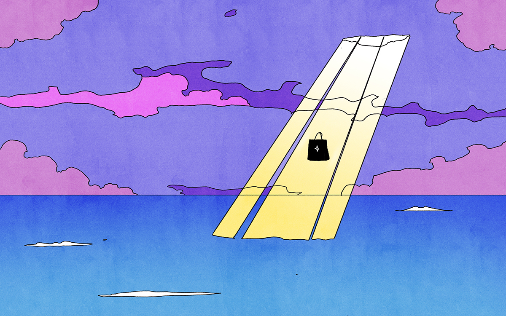

<figure>

<figcaption>Illustration by Maria Medem.</figcaption>
</figure>

*This was originally published on [Eye on Design](https://eyeondesign.aiga.org/what-makes-something-a-cult-and-something-else-a-brand/) in June 2022.*

* * *

There’s a scene about halfway through *Heaven’s Gate: The Cult of Cults* that somehow felt more unbelievable than everything else that had come before. The 2020 three-part HBO documentary series recounts the story of Heaven’s Gate, a 1990s cult group that believed there was an earth-bound spaceship behind the Hale-Bopp comet, steered by extraterrestrial servants of God who were returning to help humanity ascend to heaven. The group, led by a former seminary student, Marshall Applewhite (who later went by the name “Do”), grew increasingly secluded as all its members began dressing the same and sporting identical androgynous haircuts. The group came to an end in March 1997, when they committed mass suicide in matching Nike tracksuits, believing that it was only through death that they’d reach “the next level”, a phrase they created to define returning to God. The Heaven’s Gate suicides are still the largest mass suicide on US soil.

But none of that was the surprising part. In the second episode, in a clip lasting no more than a minute, the filmmakers tell us that Heaven’s Gate was early to connect to the then-new World Wide Web and helped fund their activities through a studio called Higher Source, which offered graphic and web design services. The website for Higher Source, which is still accessible thanks to the Internet Archive, advertised services in website design, graphic design, audio/video, programming, and systems analysis. “Graphics can add the punch needed to attract the attention of even the most elusive Web surfer,” it stated. “Whether using stock or custom photography, cutting-edge computer graphics, or plain HTML text, Higher Source can go from ‘cool’ to ‘corporate’ like a chameleon.” To read through the language on Higher Source’s website is like reading the services offered by any top-notch branding studio.

I was surprised an extraterrestrial-worshiping group that ended in mass suicide also offered graphic design services, but maybe I shouldn’t have been. Cults are infamously image-obsessed, whether it’s Heaven’s Gate’s *Star Trek*-inspired iconography or Scientology’s use of celebrity spokespeople. They need to be savvy marketers to attract new followers. Cults, in this way, are just like brands, built around developing a coherent identity, complete with codes, imagery, and language that paint a clear worldview and ideology. (Nowhere is this more obvious than on social media, where the dominant action is to follow.) Nearly every cult uses the methods of branding to gain followers and every brand — whether they admit it or not — strives for a cult-like audience.

* * *

**Read the rest of the interview [on *Eye on Design*](https://eyeondesign.aiga.org/what-makes-something-a-cult-and-something-else-a-brand/).**
