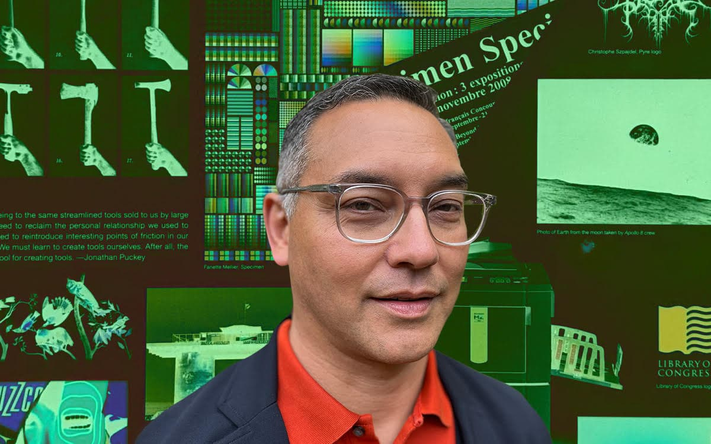

<figure>

</figure>

**This essay was originally published [on *Eye on Design*](https://eyeondesign.aiga.org/andrew-satake-blauvelt-elevated-graphic-design-far-beyond-notions-of-problem-solving/) on August 8, 2022.**

“Graphic design must be seen as a discipline capable of generating meaning on its own terms without undue reliance on commissions, prescriptive social functions, or specific media or styles,” wrote designer, curator, and writer Andrew Satake Blauvelt in 2003.

His influential essay “Towards Critical Autonomy or Can Graphic Design Save Itself?” was published in Emigre magazine alongside a body of other writing on the notion of “design authorship.” It was an idea that gained prominence in the 1990s when Blauvelt, along with a small but engaged group of other designer-writers, became interested in approaching graphic design not simply as a container for content — but as a way to create cultural meaning on its own terms, elevating graphic design beyond notions of “problem solving” and the constraints of commercial practice. Blauvelt, however, was not satisfied with simply writing about these ideas. His nearly thirty-year career has become an embodiment of them.

Throughout this working life, Blauvelt has moved between traditional design practice, design education, historical research, writing and criticism, and museum curation and administration. This polymathic work — which includes eighteen years at the Walker Art Center in Minneapolis as well as Blauvelt’s current appointment as director of the Cranbrook Art Museum — is united by a continual search for the autonomy he first wrote about in that 2003 essay. Throughout his extensive career, he’s continued to critique, analyze, and elevate graphic design and its discourse.

Born in West Point, New York in 1964 and raised in Indianapolis, Blauvelt studied visual communication and photography at the Herron School of Art in Indianapolis. As an undergraduate, he was exposed to a rare-at-the-time design program that wasn’t simply commerce-focused, but also incorporated the history and theory of graphic design. Blauvelt, who developed an immediate interest in this side of the practice, quickly continued his education at the Cranbrook Academy of Art, where the design department was led by Katherine and Micheal McCoy. Their program had made a name for itself as the epicenter of progressive graphic design and a hotbed for the intersection of design and critical theory.

Upon graduation, Blauvelt spent a year teaching in Florida and another two back at Herron before making his way to Raleigh, North Carolina to teach in North Carolina State University’s College of Design. Already a prolific writer, Blauvelt focused his research on publishing, design history, and cultural theory, alongside running an active freelance practice. His writing appeared in a variety of design journals and publications, and he guest-edited three seminal issues of the academic journal Visible Language, all focused on design history. “He brought an interest in theory, high standards for master’s student performance, and articulate arguments the department needed to reach parity with the more established programs in architecture,” said Meredith Davis, professor emerita and former department head of graphic design at NC State. “Andrew didn’t suffer fools gladly, but he quickly earned the respect of faculty in the College of Design and students welcomed his patient but honest critiques.”

* * *

**Read the entire essay [on *Eye on Design*](https://eyeondesign.aiga.org/andrew-satake-blauvelt-elevated-graphic-design-far-beyond-notions-of-problem-solving/).**
