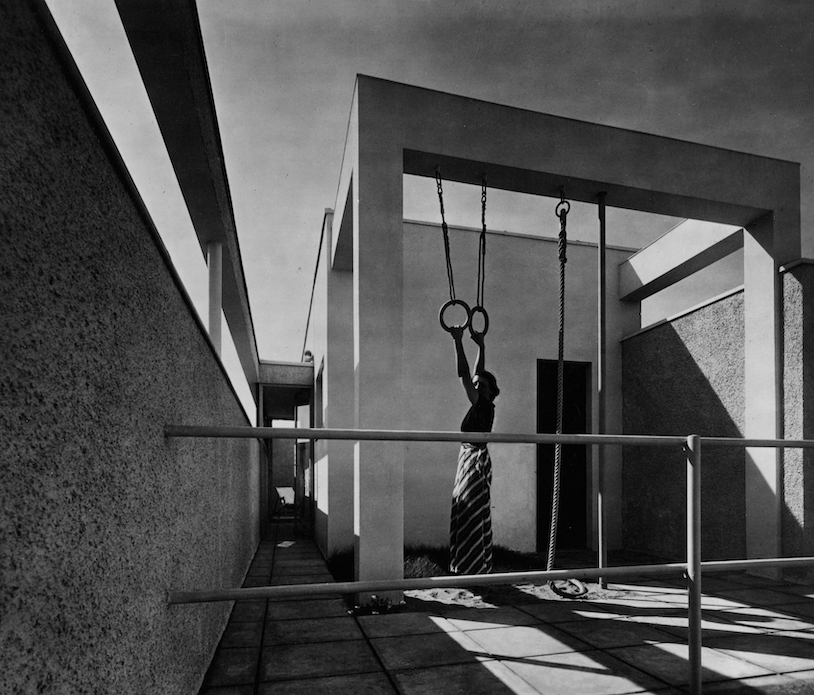

<figure>

</figure>

**This piece was [originally published in *Untapped Journal*](https://www.untappedjournal.com/issues/issue-8/advanced-school-of-collective-feeling-bauhaus-nile-greenberg-matthew-kennedy).**

***

When Walter Gropius, the founding director of the Bauhaus, stepped down from the school, in 1928, he appointed Hannes Meyer, the school’s head of architecture, to take over. Largely overlooked in the Bauhaus’s history—Meyer was one of three directors from the school’s short tenure, following Gropius and preceding Ludwig Mies van der Rohe—the Swiss-born architect’s two-year term ended in accusations of Communism in an increasingly precarious political environment.

Meyer joined the school in the midst of reverberations from the second industrial revolution, where he found the Bauhaus navigating the newfound tensions between individual expression and mass production. It is here that Meyer’s impact on the school is perhaps most evident: He came down firmly on the side of the latter. In a 1926 essay titled “The New World,” Meyer wrote what would become, in essence, his manifesto for the institution. “Trade union, co-operative, Lt., Inc., cartel, trust, and the League of Nations are the forms in which today’s social conglomerations find expression, and the radio and the rotary press are their media of communication,” he wrote. “Co-operation rules the world. The community rules the individual.”

For Meyer, the collective was *die neue baulehre*, “the new way to build.” In other words, it was within the group that artistic expression could be found. He believed that sport, and physical activity more generally, provided an ideal metaphor for the collective, and that the gymnasium had replaced the museum as the primary site where ideas and emotions emerged. “The stadium has carried the day against the art museum, just as bodily reality has taken the place of beautiful illusion,” Meyer continued. “Sport unifies the individual with the masses. Sport is becoming the advanced school of collective feeling.”

***

[Read the entire essay on Untapped's website →](**This piece was [originally published in Untapped Journal](https://www.untappedjournal.com/issues/issue-8/advanced-school-of-collective-feeling-bauhaus-nile-greenberg-matthew-kennedy).**)
