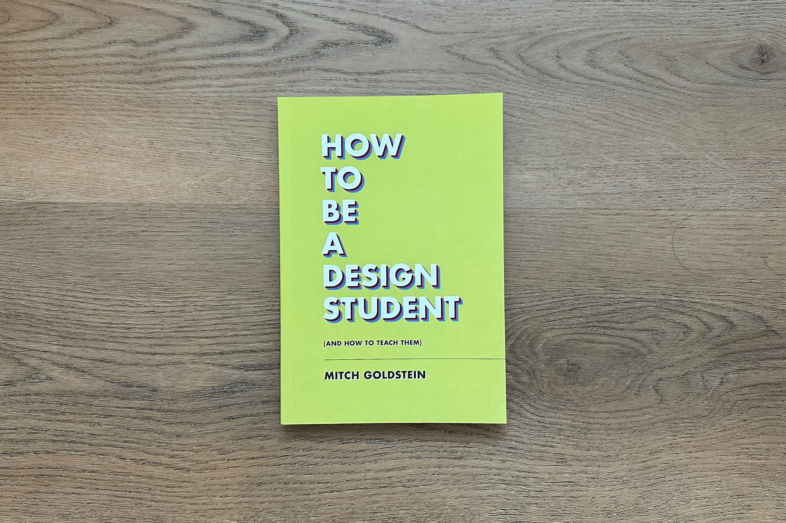
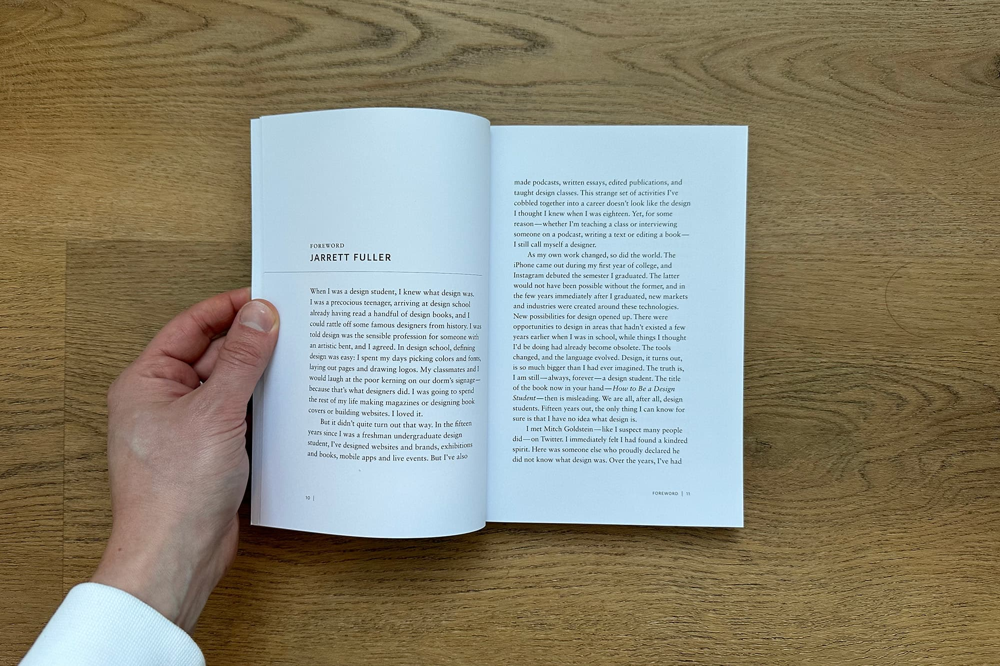

<figure>

    
</figure>

**I was honored to the write the foreword for Mitch Goldstein's excellent book [How To Be A Design Student (And How To Teach Them)](https://papress.com/collections/coming-soon/products/how-to-be-a-design-student), published in March 2023 by Princeton Architectural Press.**

When I was a design student, I knew what design was. I was a precocious teenager, arriving at design school already having read a handful of design books and could rattle off some famous designers from history. I was told design was the sensible choice for someone with an artistic bent and I agreed. In design school, defining design was easy: I spent my days picking colors and fonts, laying out pages and drawing logos. My classmates and I would laugh at the poor kerning on our dorm’s signage, thinking that’s what designers did. I was excited to spend the rest of my life making magazines or designing book covers or building websites. I loved it.

But it didn’t quite turn out that way. In the fifteen years since I began undergrad, I’ve designed websites and brands, exhibitions and books, mobile apps and live events. But I’ve also made podcasts, written essays, edited publications, and taught design classes. This strange set of activities I’ve cobbled together into a career doesn’t look like the design I thought I knew when I was eighteen. Yet, for some reason — whether I’m teaching a class or interviewing someone on a podcast, writing a text or editing a book — I still call myself a designer.

As my own work changed, so did the world. The iPhone came out my first year of my undergraduate studies and Instagram debuted the semester I graduated. The latter would not have been possible without the former and in the few years immediately after I graduated, new markets and industries were created around these technologies. New possibilities for design opened up. There were opportunities to design in areas that didn’t exist a few years earlier when I was in school while things I thought I’d be doing quickly proved obsolete. The tools changed and the language evolved. The truth is, design is so much bigger than I ever imagined. In this sense, I am still — always, forever — a design student. The title of the book now in your hand — “How To Be A Design Student” — then, is misleading. We are all, after all, design students. Fifteen years later the only thing I can confidently know for sure is that I have no idea what design is...

[Buy the book →](https://papress.com/collections/coming-soon/products/how-to-be-a-design-student)
