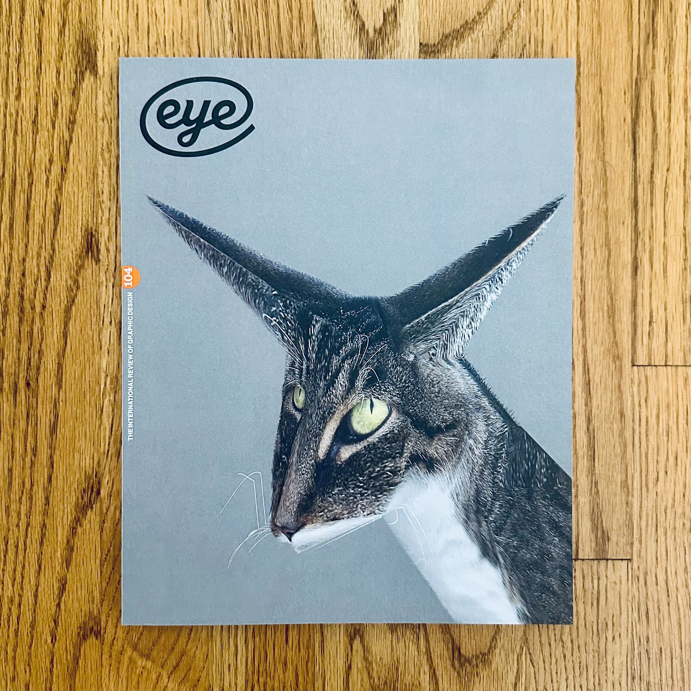

<figure>

</figure>

**This review was [originally published in Eye Magazine, issue 104](https://www.eyemagazine.com/review/article/the-purpose-is-what-it-does).**

***

What happens to a design after it has entered the world? What new meanings are generated from it? What unintended consequences come from its distribution? What unusual juxtapositions develop in a new context? How is it received differently, on the street by a pedestrian? What does it make us feel when it is removed from the slick, credited, studio portfolio website? These questions animate Graphic Events.

Authors and editors Nick Deakin and James Dyer, both graphic designers and educators, write in the book’s introduction that such questions are all too often left out of the design discourse, which instead favours analysis of process, concept, and the final artefact...

***

[Read the entire interview in Eye Magazine, issue 104 →](https://www.eyemagazine.com/review/article/the-purpose-is-what-it-does)
