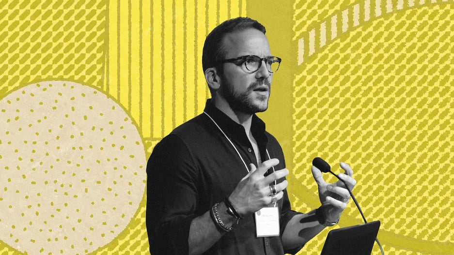

<figure>

</figure>

**This interview was [originally published in Fast Company](https://www.fastcompany.com/90909909/manuel-lima-new-designer) on June 20, 2023.**

***

Manuel Lima has worked across nearly every area of the design field. With degrees in industrial design and design and technology, he’s been a digital designer at tech startups and led UX teams at corporations like Microsoft and Google. Alongside these roles, in 2005, he founded VisualComplexity.com, an archive of more than 1,000 network visualizations that would become one of the most popular data visualization resources on the internet. This research led to the publication of three books on data visualization: Visual Complexity, The Book of Trees, and The Book of Circles. He’s also a fellow at the Royal Society of Arts.

His new book, The New Designer, is a noticeable departure from his previous titles. Conceived in the midst of a mid-life crisis after turning 40, Lima started to question his role as a designer, asking big questions about the profession. “A midlife crisis can be a positive thing,” Lima told me. “I had these great experiences but I kept seeing places where design was blind to the true impact it was having on the world.” What began as a series of letters to his younger self that mixed practical career advice and philosophical questions about design’s roles in the world grew into a proposal for a new mandate for the designer: someone who values collaboration, embraces unpredictability, is rooted in ethics, and concerned with the future.

The New Designer looks at nine myths that are popular in today’s design industry—from the benign “design is perfection” to the potentially controversial “design is for humans”—and seeks to reframe them, making space for a new type of designer, one who is prepped to deal with the most pressing issues facing us, as a profession, as a society, and as a planet. I spoke with Lima about the big ideas in the book; our conversation has been edited for clarity.

***

**What is the “new designer” and how does it different from the “old designer”?**

Manuel Lima: In the book, I try to debunk nine myths that I think are holding designers back from reaching their true potential, both as individuals but also of what design can be as a practice. We have these processes—design thinking methodologies like the double diamond or the Stanford model—and we’ve gotten so used to them that we don’t even see them anymore. We have to abandon a lot of these processes because they often end with a deliverable. Designers are evaluated by the number of launches, the number of products they ship, the number of clicks, and not so much the quality of the design, the impact on the environment, and the ethical concerns around what we make.

The new designer is less concerned with a deliverable—something tangible—and more concerned with the impact of their design on the world as much as the design itself. They are thinking about ethics; they are thinking about the systems and cultures that embody the design; they are thinking about its long-term future and the impact after they are gone.

***

[Read the entire interview on fastcompany.com →](https://www.fastcompany.com/90909909/manuel-lima-new-designer)
