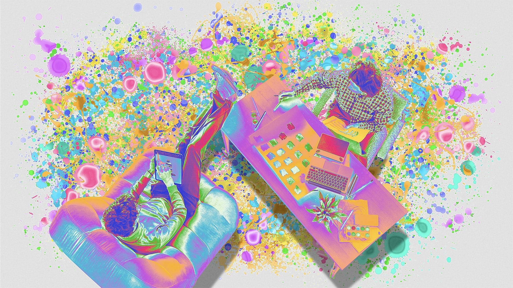

<figure>

</figure>

**This piece was [originally published in *Fast Company* on December 12, 2024](https://www.fastcompany.com/91244915/the-design-industry-is-broken-these-design-coaches-want-to-fix-it).**

***

By most external factors, Renda Morton had a successful career in design. In the late 2000s, she co-founded the design studio Rumors where she and the team worked on identities, websites, and books for a range of clients. She joined The New York Times as a designer in 2012, eventually becoming the paper’s Vice President of Design before moving to California to lead product design at Dropbox in 2018.

But in late 2020, in the midst of COVID-19, she started to experience a burnout. The challenges of managing a team remotely and the unexpected loss of a parent forced her to question why she was doing this. So in 2022, she and her partner left their jobs to figure out what was next. “Let’s redesign our lives and figure out where work fits instead of the other way around,” is how she described this process to me. They spent time traveling and thinking about what they wanted, both in work and in life.

Since February of last year, Morton, who now lives in New Mexico, has been working as a career coach. “I realized that I didn’t really care about the product we were designing,” she says, reflecting on working in tech. “But what I really cared about were the people I worked with.” Her job in design leadership, she realized, was less about designing and more about the people she was with: mentoring them, helping them do their best work, and finding balance in an increasingly uncertain moment. She now works with clients, mostly in design and around the design world—designers, engineers, product managers—who need help navigating their careers, from small decisions like trying to get that next promotion to bigger shifts like moving states or changing jobs.

The move from designer to career coach might read, at first, like a big jump, but Morton is not alone. Amy Santee, a former designer researcher at eBay who is now a coach, maintains a public directory of coaches for people in the UX industry that runs nearly ten pages (at least two dozen are specifically listed as coaches for designers). As coaching as a field has grown in popularity—especially around Silicon Valley—designers, at the top of their careers, are increasingly making the transition into coaching work. 

***

[Read the entire essay on Fast Company →](https://www.fastcompany.com/91244915/the-design-industry-is-broken-these-design-coaches-want-to-fix-it)
