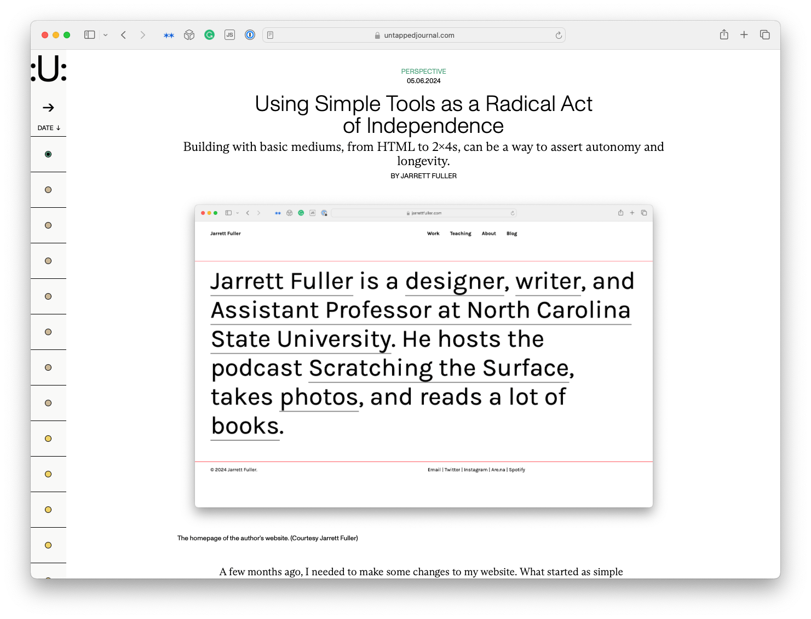

<figure>

</figure>

**This piece was [originally published in *Untapped Journal* on May 6, 2024.](https://www.untappedjournal.com/issues/issue-11/jarrett-fuller-building-with-simple-tools-longevity).**

***

A few months ago, I needed to make some changes to my website. What started as simple content edits—updating my biography, adding projects to my portfolio—quickly spiraled into a bigger project. New content types required new templates. My website is hand-built; I don’t use a content management system or an off-the-shelf-platform. Before I knew it, I was staying up late, rethinking the content architecture from the ground up.

I’ve been making websites for 20 years, and have been building and rebuilding my own website for just as long. I taught myself HTML when I was 15 by clicking “View Source” in my web browser, then copying and pasting snippets of code to hack together simple web pages until they looked good and functioned properly. Since then, I’ve used HTML (albeit in a more sophisticated capacity) and CSS, another coding language, to make nearly every website I’ve ever worked on. It recently dawned on me that many of the design tools I used when I began my career are now obsolete or have radically changed. Updating my website these last few months, I sometimes felt like I was 15 again.

Websites are perhaps the only type of design project I can work on the same way I did when I was a teenager. Figma didn’t exist, nor did any of the other upstart design software companies that have come and gone over the years. The Adobe Creative Suite looks increasingly unrecognizable to me, and I’m often unable to open files I created in previous versions. As an undergraduate design student, I took three required classes on Adobe Flash, software that, at the time, felt like the future of web design before it fell out of favor a few years later.
***

[Read the entire essay on Untapped's website →](https://www.untappedjournal.com/issues/issue-11/jarrett-fuller-building-with-simple-tools-longevity)
