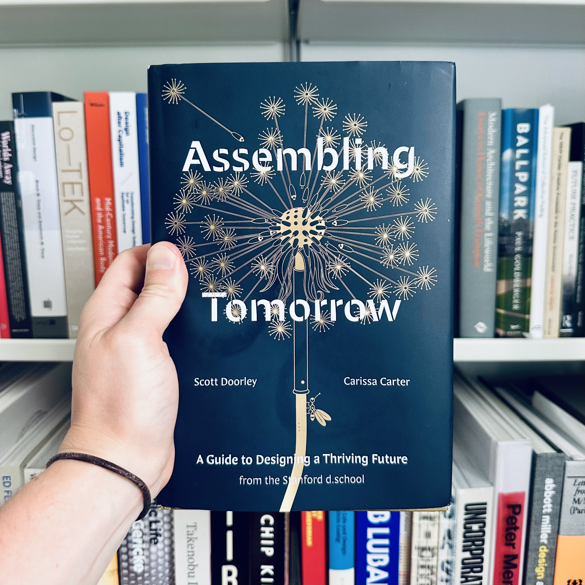

<figure>

</figure>

**This interview was [originally published in Fast Company](https://www.fastcompany.com/91153344/stanford-design-book-assembling-tomorrow) on July, 11, 2024.**

***

“In an environment that is screwed up visually, physically, and chemically, the best and simplest thing that architects, industrial designers, planners, etc., could do for humanity would be to stop working entirely,” wrote Victor Papanek in his class 1971 book, _Design for The Real World._ Fifty years later, there’s still a truth in his critique that rings true to me. In this moment when it seems every system is collapsing in on itself from pressures—the rise of artificial intelligence, the instability of democracies, the ever-present climate crisis—the role of the designer can feel uncertain.

I was thinking about Papanek’s line while reading the new book, _Assembling Tomorrow: A Guide to Designing a Thriving Future_ by Scott Doorley and Carissa Carter, out now from TenSpeed Press. Carter and Doorley, the academic director and creative director, respectively, at Stanford’s d.school, are much more optimistic about the role of design in creating a future that looks better than the present. Divided into two parts, “Intangibles” and “Actionables,” Doorley and Carter write about what they call “runaway design,” or the feeling that the systems we’ve made are out of our control and what we can do to reshape them. Interspersed throughout are a series of short fictional stories—dispatches from the future—that bring the often abstract ideas back down to reality. 

I’ll admit to being skeptical of an overly optimistic view of design. On my worst days, I’m more Papanek than Stanford’s d.school, but what I think Doorley and Carter are doing in the book is not blind optimism but rather a reclaiming of design as a future-oriented practice, available to everyone. In this moment when design can feel like a tool for profit, for markets, for power, _Assembling Tomorrow_ paints design as a tool for everyone who is interested in building better futures and how to use that tool with care, inclusion, and rigor. To design in this moment, they write, requires you “reconsider how you measure success, remove what's not working, reorient yourself, and remake the way you do things.” I was interested in speaking with them about their optimism for design, where the design professions go next, and how we take back the reins of runaway design. Our conversation was edited for clarity. 

**How do you define design?**

**Scott Doorley:** I like to use the metaphor of a solid, a liquid, and a gas. Design started off as a solid, where it's about making things that act in the world. Then it moved into a liquid, which is more about how we design experiences and services. Design is not just the thing, but it's the stuff around it. Right now, it feels like design is turning into this gas, where it really is everything, you know? It's not just the thing, the services, the experience, but also the impacts and the systems. What design has been asked to do has expanded over time. 

I think the difference between design and other disciplines of making is that design is about desirability. It's about finding what you care about, and then embodying that in the world. And that's a really specific way to go about doing things. I think it's a helpful way, but it can also be harmful.

**Carissa Carter**: When we talk about design, we think of it on many levels and layers. If I pick up my phone, for example, it is a physical object that was designed—somebody decided on the radius of the corners and the materials to manufacture it. But it’s not just a physical object, it’s also a digital object; each app was designed, too. There were wireframes to determine the flow, there was graphic design work on the icons and the interface. Each of these enables any number of experiences to happen. I can have this video call with somebody like you on the other side of the country; somebody designed how this interaction can take place so there is also an experience layer. These products and experiences, then, live within any number of systems that exist in the world. I have a phone plan that decides where in this country I get access to that phone system. If I want a new app, I go to an app store which has its own rules for how people can contribute and what we can download. Then, nested within everything, there's the technology that powers all of that, including emerging technologies like machine learning algorithms that learn from us. What was included in the data? How it learns is a design decision. 

So design is data, tech, product, experience, and system. All of those layers have implications, both positive and negative, both near term and long term. There are apps on my phone right now that have allowed people to come together and assist in being a voice for change, and those same apps have also enabled school bullying and declining mental health in our youth. That's all design work. We think of design individually as each of those layers, but also that full stack.

***

[Read the entire interview on fastcompany.com →](https://www.fastcompany.com/91153344/stanford-design-book-assembling-tomorrow)
