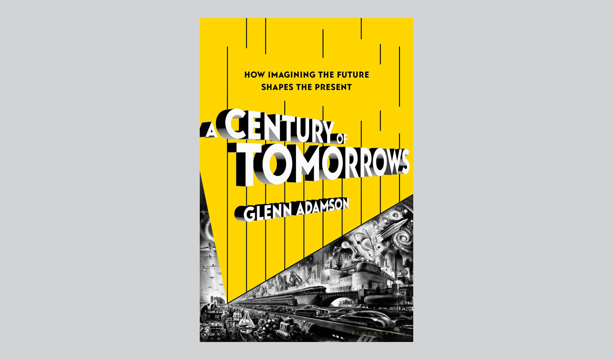

<figure>

</figure>

**This piece was [originally published in *The Architect's Newspaper* on January 22, 2025](https://www.archpaper.com/2025/01/in-a-century-of-tomorrows-glenn-adamson-chronicles-the-history-of-predicting-the-future/).**

***

“Anyone who thinks about the future,” Albert Einstein wrote in a contribution to the 1939 World’s Fair time capsule that was intended to be opened in the year 6939, “must live in fear and terror.” Today, nearly 85 years later, the great physicist’s words feel like good advice. As we enter a new year, the future can seem bleak with challenges ahead: The ever-present climate crisis, uncertainties around AI, wars around the world, the instability of democracies… How can we not live in a constantly anxious state?

Einstein’s words appear around a third of the way through historian Glenn Adamson’s dazzling new book, *A Century of Tomorrows: How Imagining the Future Shapes the Present*. But unlike Einstein, Adamson aims to look backwards, not forwards; he surveys the history of futurology, trend forecasting, and predictions. Once relegated to the mystical—think prophets, witchcraft, and Tarot cards—Adamson’s story begins at the turn of the 20th century, when futurism moved from the spiritual to the concrete. “[Futurology] takes the broad view, making predictions about society at large, usually over a relatively long time span,” Adamson argues. “It is an incredibly varied activity, undertaken by social theorists and political activists, trend forecasters and insurance executives, architects and industrial designers, urban planners and military war gamers, fiction writers and film directors.”

Adamson moves seamlessly between this diverse group of thinkers and mixes sci-fi writers and government bureaucrats in scenes set in corporate boardrooms and hippie communes. We see how Robert McNamara and the rise of the managerial class creates systems of planning and big data to project into the future and, later, considers Stewart Brand’s *Whole Earth Catalog*, a counterculture publication deeply interested in the future that inspired thinking dominant in Silicon Valley today. These examples are contrasted with new wave science fiction writers like Ursula Le Guin, whose work challenged power and gender dynamics, or Samuel Delany, whose work Adamson argues predates contemporary discourse around “trans” and “intersectional” identity. Taken together, Adamson makes the case that looking into the future is actually a way to contend with the conditions of the present.

***

[Read the entire essay at The Architect's Newspaper →](https://www.archpaper.com/2025/01/in-a-century-of-tomorrows-glenn-adamson-chronicles-the-history-of-predicting-the-future/)
