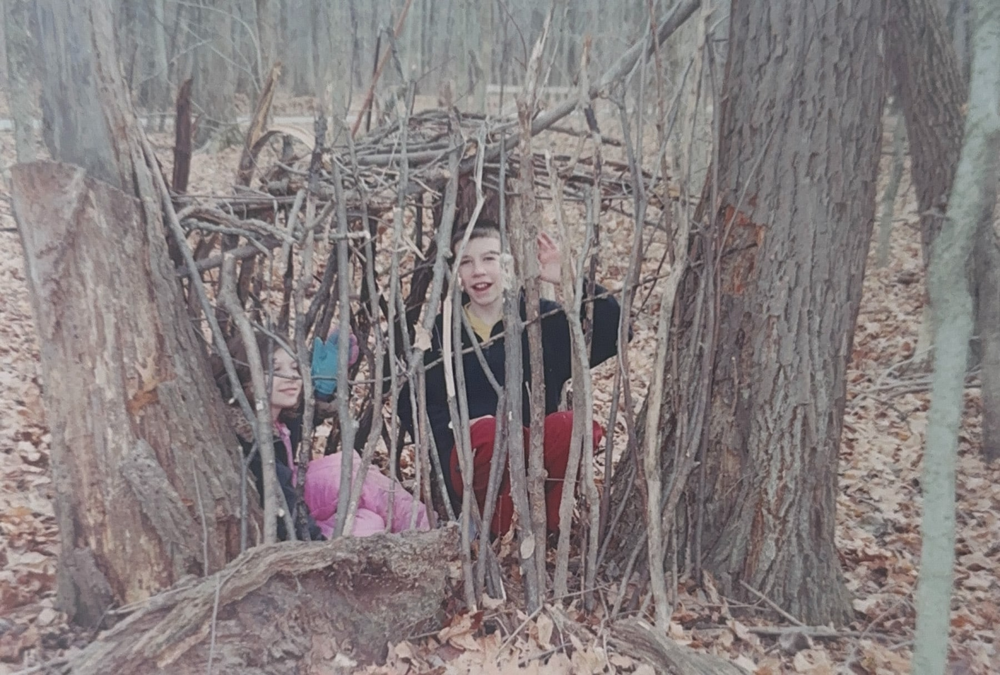

<figure>

</figure>

**This piece was [originally published in *Untapped Journal* on May 19, 2025](https://untappedjournal.com/stories/the-lesson-i-learned-at-summer-camp).**

***

About 80 miles northwest of Indianapolis, Indiana’s capital and largest city, the Tippecanoe River bends tightly back on itself, creating a small valley surrounded by water. One hundred years ago, 30 acres of this undeveloped land were sold by a local farmer to the nearby town of Delphi, for $3,000, so that a summer camp could be built there.

Summer camps, alongside urban playgrounds and youth organizations such as the Boy Scouts, were popping up around the country at the time to provide children a healthy outdoor experience that could be both structured and exploratory. The YMCA, which opened many of these camps, was operating one in Bedford, a city in the southern part of the state, and wanted to build another somewhere north. If Delphi promised to maintain an active road to the property and a “friendly attitude” to the camp, the organization would open a camp there. In 1924, Camp Tecumseh—named after a Shawnee chief who opposed European expansion and fought in a battle nearby—hosted its first campers. Cabins weren’t complete, so campers stayed in tents, spending their days swimming in the Tippecanoe River that encompassed them. 

The new camp proved popular and grew quickly and continuously. It bought surrounding land and designed, built, and renovated everything on it over time, expanding the property to just shy of 700 acres. When Camp Tecumseh celebrated its centennial, last year, it was hosting some 30,000 people annually, making it one of the largest camps in the country. When I was 10 years old, Camp Tecumseh became something else: home.

***

[Read the entire essay on Untapped's website →](https://untappedjournal.com/stories/the-lesson-i-learned-at-summer-camp)
