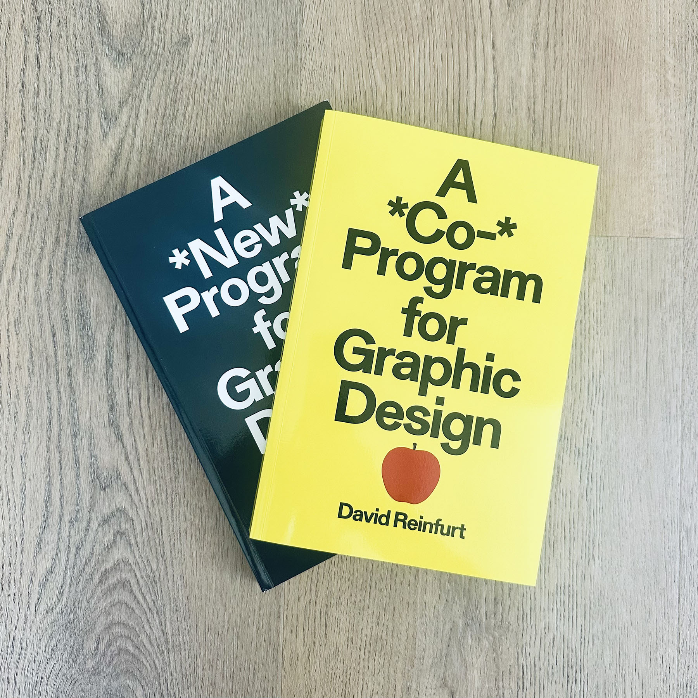

<figure>

</figure>

**This interview was [originally published in Fast Company](https://www.fastcompany.com/91349939/david-reinfurt-on-why-its-time-to-rethink-how-we-teach-design) on June 14, 2025.**

***

Designer, editor, and educator David Reinfurt’s 2019 book, _A *New* Program for Graphic Design_ (Inventory Press) was a surprise success, selling out its initial print run in three weeks. It’s now in its third edition with translations in Chinese, French, German, Italian, Korean, and Spanish. The book was described as a “do-it-yourself textbook,” but a traditional design textbook it was not. Across its three chapters—Typography, Gestalt, and Interface—Reinfurt draws on designers, printers, artists, and publishers to show that graphic design is not a narrow area of study but rather a broad way of looking at how we understand the world. 

The creation of the book, too, was as unusual as its contents. The three chapters were based on three courses Reinfurt had been teaching at Princeton University. To produce the book, Reinfurt presented all his lectures from all three courses to an audience at Inventory Press’s studio in Los Angeles. Transcripts were produced from the three days that were then edited to form the book, making for a casual, dialogue-driven text that is at once personal, meandering, and expansive. 

Now, Reinfurt and Inventory Press are releasing a follow-up book, _A *Co-* Program for Graphic Design_, that is based on three of Reinfurt’s new courses: Circulation, Multiplicity, and Research. Reinfurt taught these courses over Zoom, during the pandemic, and much like the first book, used the recordings from those sessions as the structure for the new book. Because of the limitations and opportunities of teaching over Zoom, _A *Co-* Program_ introduces a series of new voices, guest lectures from each course, which further expand our understanding of what graphic design can be.

In a moment where graphic design is undergoing profound change, I find this pair of books to help situate both what it means to be a graphic designer and what it means to teach graphic design. Reinfurt, I think, offers a timeless approach to graphic design that transcends technical skills, industry demands, and visual fads in favor of treating design as a serious area of study that blends disciplines and ways of thinking. I was curious to talk with him about the ideas in the books and why graphic design, as a term, is still a useful framing device. Much like the creation of the books themselves, this conversation was conducted over Zoom and edited for clarity. And like their content, this conversation meanders and moves, attempting to find new ways to teach graphic design.

* * * 

**I want to begin by talking about the title of this book. You open _A *Co-* Program for Graphic Design_ with a list of all the alternative titles you had come up with and a roundtable conversation with some former students about what “Co-program” means. I want to ask you about the other part. I want to ask you about “graphic design.” What is graphic design?**

You have to find a place to locate yourself. Over the years, I've worked between a lot of different areas, but my training was in graphic design and I hang on to that as a label.

But you're asking what graphic design is. That term has been around at least for enough time to gather some historical weight, and I like that too. The first book was originally going to be titled _A New Primer for Visual Literacy_, as a play on Donis Dondis’s Primer of Visual Literacy, but we decided to rename it because it didn’t feel like a good idea to riff on a previous book. We landed on _A *New* Program for Graphic Design_, which I liked a lot. People know the term graphic design. People are often confused about it, but at least it's familiar.

***

[Read the entire interview on fastcompany.com →](https://www.fastcompany.com/91349939/david-reinfurt-on-why-its-time-to-rethink-how-we-teach-design)
